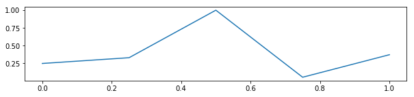
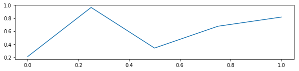

# An example notebook

A [Jupyter notebooks](http://jupyter.org/) mixes blocks of explanatory text, like the one you're reading now, with cells containing Python code (_inputs_) and the results of executing it (_outputs_).  The code and its output&mdash;if any&mdash;are marked by `In [N]` and `Out [N]`, respectively, with `N` being the index of the cell. You can see an example in the computations below:

    In [1]: def f(x, y):
                return x + 2*y

    In [2]: a = 4
            b = 2
            f(a, b)
    
    Out[2]: 8

By default, Jupyter displays the result of the last instruction as the output of a cell, like it did above; however, `print` statements can display further results.

    In [3]: print(a)
            print(b)
            print(f(b, a))
    
    Out[3]: 4
            2
            10

Jupyter also knows a few specific data types, such as Pandas data frames, and displays them in a more readable way:

    In [4]: import pandas as pd
            pd.DataFrame({ 'foo': [1,2,3], 'bar': ['a','b','c'] })
    
    Out[4]: 

{width="narrow"}
|   | foo | bar |
|---|-----|-----|
| 0 |   1 |   a |
| 1 |   2 |   b |
| 2 |   3 |   c |

The index of the cells shows the order of their execution. Jupyter doesn't constrain it; to avoid confusing people, though, you better write your notebooks so that the cells are executed in sequential order as displayed.  All cells are executed in the global Python scope; this means that, as we execute the code, all variables, functions and classes defined in a cell are available to the ones that follow.

Notebooks can also include plots, as in the following cell:

    In [5]: %matplotlib inline
            import numpy as np
            import matplotlib.pyplot as plt
            f = plt.figure(figsize=(10,2))
            ax = f.add_subplot(1,1,1)
            ax.plot([0, 0.25, 0.5, 0.75, 1.0], np.random.random(5))
    
    Out[5]: [<matplotlib.lines.Line2D at 0x7facc4f2d438>]

As you might have noted, the cell above also printed a textual representation of the object returned from the plot, since it's the result of the last instruction in the cell.  To prevent this, you can add a semicolon at the end, as in the next cell.

    In [6]: f = plt.figure(figsize=(10,2))
            ax = f.add_subplot(1,1,1)
            ax.plot([0, 0.25, 0.5, 0.75, 1.0], np.random.random(5));

